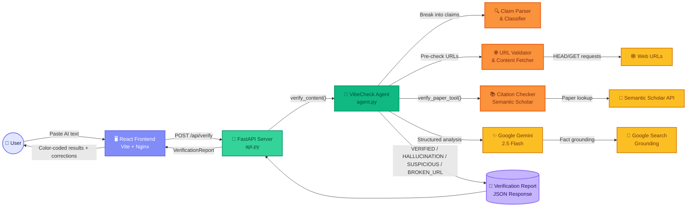

# 🛡️ HallucinationCheck AI - AI Hallucination Detector

## 🔍 Problem Statement: AI Hallucination & Citation Verification

Generative AI systems frequently produce confident yet factually incorrect content, including fabricated claims. A major risk is the generation of fake citations, non-existent references, and unverifiable sources. Such outputs undermine trust, reliability, and ethical use of AI-generated information. Users currently lack effective tools to verify factual accuracy and citation validity in AI responses. This project aims to detect, flag, and verify claims and citations to distinguish reliable AI output from hallucinations.

**Project Name:** FactCheck AI - AI Hallucination Check  
**Team Name:** Beatrix Kiddo  
**PPT Link:** [View Presentation](https://drive.google.com/drive/folders/1R828wnpcfe0HLdnatcAFNfGugjtrW16E?usp=drive_link)

**Video Link:**[view Demo](https://drive.google.com/drive/folders/1NvrNQsfAsN7CjomcitDPx2O8QcKXCxWR?usp=sharing)

# 🎮 GFGBQ-Team-beatrix-kiddo

> A dynamic contribution to the **Vibe Coding Hackathon** by ByteQuest-2025

---

## 🌟 About This Project

This repository showcases an innovative solution developed during the Vibe Coding Hackathon.  Our team brings together creativity, technical expertise, and collaborative spirit to deliver a unique application that combines multiple technologies. 

**Project Name:** GFGBQ-Team-beatrix-kiddo  
**Event:** Vibe Coding Hackathon (ByteQuest-2025)  
**Status:** ✨ Active Development

---

## 🛠️ Tech Stack

Our project is built with a modern, versatile technology stack: 

| Technology | Usage | Percentage |
|-----------|-------|-----------|
| **Python** | Backend Logic & Core Functionality | 36.3% |
| **JavaScript** | Frontend Interactivity | 27.9% |
| **CSS** | Styling & UI Design | 29% |
| **HTML** | Page Structure | 0.9% |
| **Docker** | Containerization & Deployment | 1.5% |
| **Shell** | Scripting & Automation | 1.8% |
| **Batch** | Windows Automation | 2.6% |

---

## Architecture



---

## ✨ Key Features

- 🚀 **Fast & Efficient** - Optimized Python backend for performance
- 🎨 **Beautiful UI** - Responsive design with modern CSS and JavaScript
- 📦 **Docker Support** - Containerized for easy deployment
- 🔧 **Cross-Platform** - Works on Windows, macOS, and Linux
- 💡 **Innovative Solution** - Creative approach to the hackathon challenge

---

## 🚀 Getting Started

### Prerequisites
- Python 3.8+
- Node.js 14+ (for JavaScript dependencies)
- Docker (optional, for containerized deployment)

### Installation

1. **Clone the repository**
   ```bash
   git clone https://github.com/ByteQuest-2025/GFGBQ-Team-beatrix-kiddo.git
   cd GFGBQ-Team-beatrix-kiddo
   ```

2. **Set up Python environment**
   ```bash
   python -m venv venv
   source venv/bin/activate  # On Windows: venv\Scripts\activate
   pip install -r requirements.txt
   ```

3. **Install JavaScript dependencies**
   ```bash
   npm install
   ```

4. **Run the application**
   ```bash
   python app.py
   ```

### Docker Deployment
```bash
docker build -t beatrix-kiddo . 
docker run -p 8000:8000 beatrix-kiddo
```

---

## 📖 Usage

[Add detailed usage instructions and examples here]

---

## 🎯 Project Structure

```
GFGBQ-Team-beatrix-kiddo/
├── backend/              # Python backend
├── frontend/             # JavaScript & CSS frontend
├── docker/               # Docker configuration
├── scripts/              # Automation scripts
├── requirements.txt      # Python dependencies
├── package.json          # Node.js dependencies
└── README.md            # This file
```

---

## 🤝 Team

**Team Name:** beatrix-kiddo  
**Organization:** ByteQuest-2025  
**Event:** Vibe Coding Hackathon

---

## 📝 Contributing

We welcome contributions!  To get involved: 

1. Fork the repository
2. Create a feature branch (`git checkout -b feature/AmazingFeature`)
3. Commit your changes (`git commit -m 'Add some AmazingFeature'`)
4. Push to the branch (`git push origin feature/AmazingFeature`)
5. Open a Pull Request

---

## 📄 License

This project is licensed under the MIT License - see the LICENSE file for details.

---

## 🙌 Acknowledgments

- **Hackathon:** Vibe Coding Hackathon (ByteQuest-2025)
- **Platform:** GeeksforGeeks
- Thanks to all team members for their dedication and creativity!

---


<div align="center">

**⭐ If you find this project useful, please give it a star! **

Made with ❤️ by Team beatrix-kiddo

</div>


